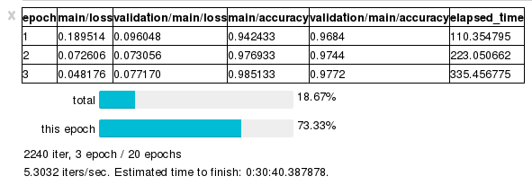

# chaineripy



Utilities to integrate Chainer with IPython.
Currently it consists two trainer extensions:
`chaineripy.extensions.PrintReport` and `chaineripy.extensions.ProgressBar`.

## INSTALL

```
pip install chaineripy
```

You need to [enable the widgets extension](https://github.com/jupyter-widgets/ipywidgets/blob/master/docs/source/user_install.md).

## USAGE

Those extensions provide the same API as Chainer's builtin counterparts, so
all you need to do is replace

```python
from chainer.training.extensions import PrintReport, ProgressBar
```

by

```python
from chaineripy.extensions import PrintReport, ProgressBar
```

when you run Chainer on a IPython notebook.

The [example notebook](extensions-example.ipynb) demonstrates the usage.

`PrintReport` and `ProgressBar` classes also export the following functions and properties.

```python
PringReport.update(self, log)
@property
PringReport.widget(self)

ProgressBar.update(self, iteration, epoch_detail)
@property
ProgressBar.widget(self)
```

For detailed usages, please see the source codes.
Using these functionalities, you can show the widgets provided
even if you don't use `Trainer` or `Updater`.

## CONTRIBUTION

Contributions are highly welcomed, including but not limited to:
new widgets or features, bug fixes, documents improvements, and aesthetic improvements.

Adding codes that work on plain terminal or other IPython consoles are welcomed, but
I won't support dynamic detection of the type of console you are working on.
If you can't write console neutral code, please create modules supporting
the same API for different consoles, and let user choose the appropriate module.
